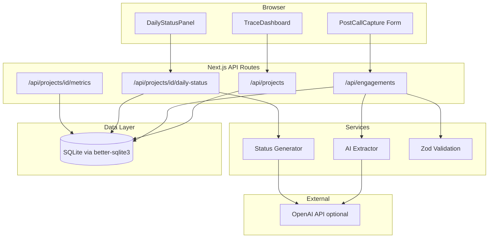

# Architecture — Conversation Trace

## Overview

Conversation Trace is a full-stack web application that helps engagement owners trace customer conversations to actionable outcomes. It replaces scattered notes and manual status writing with structured capture, AI-assisted extraction, and measurable KPI tracking.

## System diagram



## Components

| Layer | Responsibility |
|---|---|
| `TraceDashboard` | Main dashboard orchestrating all UI panels |
| `PostCallCapture` | Structured form for call notes ingestion |
| `DailyStatusPanel` | One-click status generation from project state |
| `MetricCard` | Outcome visualization: baseline → current → target |
| `lib/ai/extract.ts` | LLM extraction with rule-based fallback |
| `lib/ai/status.ts` | Daily status drafting with template fallback |
| `lib/db/` | SQLite schema, connection, seed data |

## Data model

```
projects
  └── engagements (1:N)
        └── extracted_items (1:N)
  └── daily_updates (1:N)
  └── metric_snapshots (1:N)
```

### Key relationships

- Every `extracted_item` links to both an `engagement` (source) and a `project` (context)
- Requirements receive auto-generated `linked_feature_ref` IDs for traceability
- `engagements.extraction_hash` enables idempotent re-submission of identical notes

## Request flows

### Post-call capture

1. User submits title + raw notes via `POST /api/engagements`
2. Notes hashed (SHA-256); duplicate hash returns existing extraction
3. AI extracts decisions, actions, requirements (or fallback parser runs)
4. Engagement + items persisted; dashboard refreshes

### Daily status generation

1. User clicks "Generate Today's Update"
2. System loads open items, recent engagements, latest metric snapshot
3. AI drafts status (or template fallback)
4. Update saved to `daily_updates` and displayed

### Outcome tracking

1. User records metric snapshot via form
2. `MetricCard` computes progress: `(baseline - current) / (baseline - target)`
3. History shown in metric snapshots list

## Deployment topology

- **Local / Railway:** SQLite file at `./data/conversation-trace.db` (persistent volume on Railway)
- **Vercel:** Not recommended for SQLite — use Railway or mount Turso for serverless

## Security notes (v1)

- No authentication (single-user demo scope)
- API keys stored in environment variables only
- Input validation on all mutation endpoints via Zod
